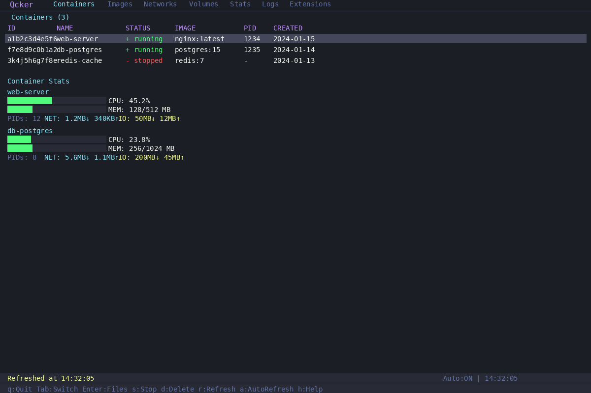

<p align="center">
  
</p>

<h1 align="center">Qcker</h1>

<p align="center">
  <strong>A daemonless, rootless container engine written in Rust</strong>
</p>

<p align="center">
  <a href="https://opensource.org/licenses/Apache-2.0"></a>
  <a href="https://www.rust-lang.org/"></a>
  <a href="#"></a>
</p>

<p align="center">
  Qcker is a lightweight, high-performance alternative to Docker.
  <br>
  No daemon. No bloat. Just containers.
</p>

<p align="center">
  <strong>Production by PaongLabs</strong>
</p>

---

## TUI Demo

<p align="center">
  
</p>

The TUI provides a visual dashboard for managing containers, browsing files, editing configs, and managing extensions with mouse support and auto-refresh.

---

## Quick Start

### Build from source

```bash
git clone https://github.com/farhanturu/qcker.git
cd qcker
cargo build --release
```

### Run a container

```bash
# Simple command
sudo ./target/release/qcker run --rootfs /path/to/rootfs -- /bin/echo "Hello"

# Interactive shell
sudo ./target/release/qcker run --rootfs /path/to/rootfs -t -- /bin/sh

# With resource limits
sudo ./target/release/qcker run --rootfs /path/to/rootfs \
    --cpus 2 --memory 512 --pids-limit 256 \
    -- /bin/sh

# With GPU
sudo ./target/release/qcker run --rootfs /path/to/rootfs \
    --gpu --vram 1024 \
    -- /bin/sh
```

### Open TUI

```bash
./target/release/qcker
```

---

## Features

### Container Management
- Create, start, stop, kill, delete containers
- List running and stopped containers
- Execute commands inside running containers
- Container logs and state inspection
- Real-time stats (CPU, memory, PIDs)

### Resource Limits
- `--cpus <cores>` - CPU cores (e.g., 1.5)
- `--memory <MB>` - Memory limit
- `--pids-limit <n>` - Max processes
- `--gpu` - Enable GPU access
- `--vram <MB>` - VRAM limit

### Security
- Rootless by default
- PID, network, mount, UTS, IPC, cgroup namespace isolation
- Seccomp syscall filtering (BPF-based)
- Capability dropping (all caps removed by default)
- pivot_root container isolation (not chroot)
- Path traversal protection in tar extraction
- Cryptographic ID generation with getrandom

### Error Handling
- Unique error codes (Q-C001, Q-I001, etc.)
- Source location tracking
- Suggestions for fixing errors
- JSON output for scripting
- Retryable error detection

### TUI (Terminal UI)
- 7 tabs: Containers, Images, Networks, Volumes, Stats, Logs, Extensions
- Browse and edit files inside containers
- Real-time stats with CPU/memory bars
- Dracula-inspired dark theme
- Mouse support (click, scroll)
- Auto-refresh
- Container actions (stop, kill, delete) from TUI
- Vim-style navigation (j/k)

### Docker-Compatible CLI
- `qcker run`, `qcker ps`, `qcker images`, `qcker build`, `qcker exec`
- `qcker network`, `qcker volume`, `qcker compose`, `qcker extension`
- `qcker stats`, `qcker logs`, `qcker stop`
- `qcker system info/prune`

---

## CLI Commands

| Command | Description |
|---------|-------------|
| `qcker run` | Run a container |
| `qcker create` | Create a container |
| `qcker start` | Start a container |
| `qcker stop` | Stop a container |
| `qcker kill` | Kill a container |
| `qcker delete` | Delete a container |
| `qcker ps` | List containers |
| `qcker exec` | Execute in container |
| `qcker images` | List images |
| `qcker build` | Build from Dockerfile |
| `qcker pull` | Pull image from registry |
| `qcker logs` | View container logs |
| `qcker stats` | View container stats |
| `qcker network` | Manage networks |
| `qcker volume` | Manage volumes |
| `qcker compose` | Manage compose apps |
| `qcker extension` | Manage extensions |
| `qcker system` | System info and prune |

---

## Architecture

```
qcker/
├── crates/
│   ├── qcker-cli/          # CLI binary + TUI
│   ├── qcker-runtime/      # OCI runtime (namespaces, cgroups, seccomp)
│   ├── qcker-backend/      # Runtime backend (native, MicroVM)
│   ├── qcker-engine/       # Image, build, network, volume, compose, extension
│   ├── qcker-common/       # Shared utilities
│   ├── qcker-error/        # Error library with codes and suggestions
│   └── qcker-ext-api/      # Extension SDK
└── target/release/qcker    # Single binary (~7 MB)
```

### Runtime Backends

| Backend | Platform | Description |
|---------|----------|-------------|
| NativeBackend | Linux | Direct namespace/cgroup usage |
| MicroVmBackend | macOS/Windows | QEMU-based MicroVM |

Backend selection is automatic based on platform.

---

## MicroVM Support

Qcker includes a MicroVM backend for running containers on macOS and Windows without a full Docker Desktop installation.

**How it works:**
- On Linux: Uses native namespaces and cgroups (no VM needed)
- On macOS/Windows: Spawns a minimal MicroVM via QEMU
- The MicroVM runs qcker-runtime as PID 1 (init process)
- Communication via vsock (zero-overhead kernel channel)
- Single VM shared by all containers (not per-container)
- Auto-shutdown after idle timeout

---

## Extensions

Browse and manage extensions in the TUI Extensions tab.

| Extension | Category | Status |
|-----------|----------|--------|
| bridge | network | Built-in |
| overlayfs | storage | Built-in |
| trivy | security | Available |
| cilium | network | Available |
| zfs | storage | Available |
| loki | logging | Available |
| buildkit | build | Available |

Request new extensions: https://github.com/farhanturu/qcker-extensions/issues

---

## Comparison

| Feature | Docker | Podman | Qcker |
|---------|--------|--------|-------|
| Daemon | Yes | No | No |
| Rootless | Optional | Yes | Yes |
| Language | Go | Go | Rust |
| Binary size | 200 MB | 100 MB | ~7 MB |
| TUI | No | No | Yes |
| GPU support | Manual | Manual | Built-in |
| Extensions | Limited | Limited | Full SDK |
| Error codes | No | No | Yes |
| MicroVM | No | No | Yes |

---

## Requirements

- Linux kernel 5.3+ (for native backend)
- QEMU (for MicroVM backend on macOS/Windows)
- Rust 1.70+ (for building)

---

## Build

```bash
cargo build --release    # Release build
cargo test               # Run tests
cargo clippy             # Lint
```

---

## License

Apache License 2.0 - see [LICENSE](LICENSE)

---

## Author

**PaongLabs**
- GitHub: https://github.com/farhanturu
- Email: paongtech@gmail.com
