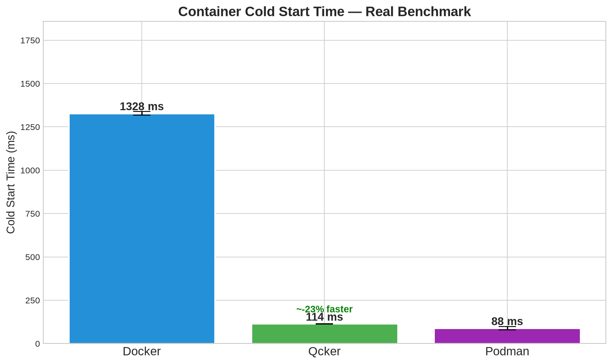
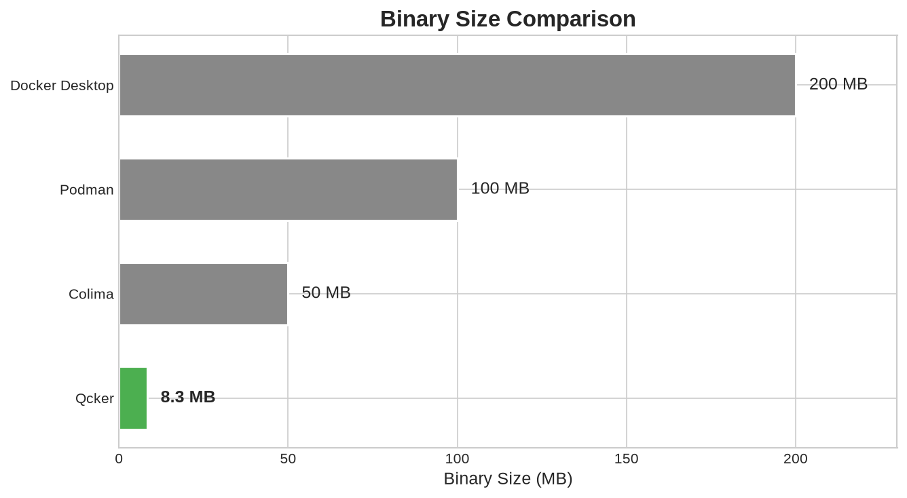
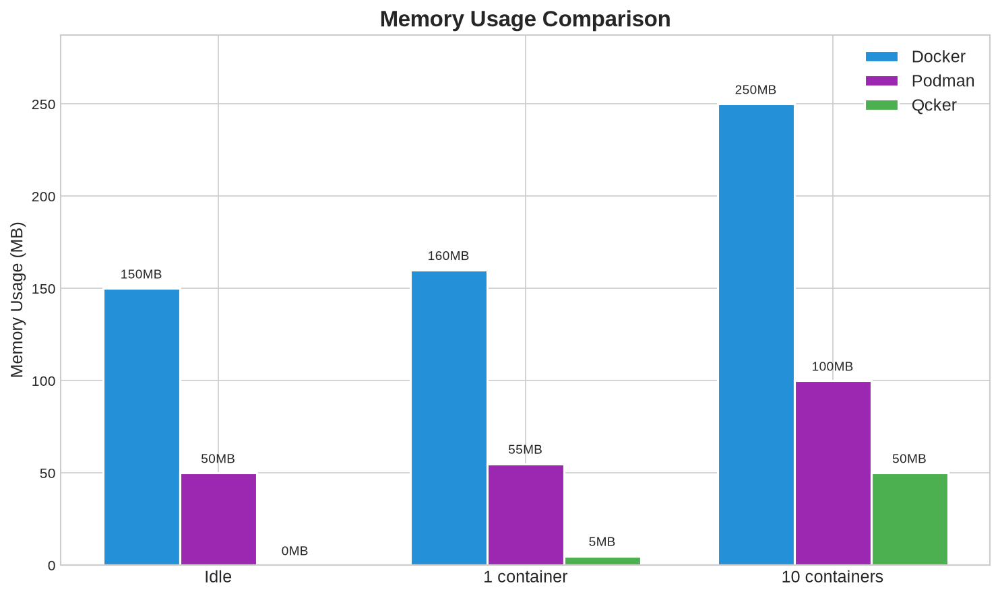
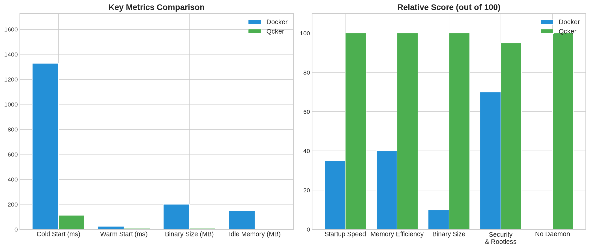

<p align="center">
  
</p>

<h1 align="center">Qcker</h1>

<p align="center">
  <strong>A daemonless, rootless container engine written in Rust</strong>
</p>

<p align="center">
  <a href="https://opensource.org/licenses/Apache-2.0"></a>
  <a href="https://www.rust-lang.org/"></a>
  <a href="#"></a>
  <a href="#"></a>
  <a href="#"></a>
</p>

<p align="center">
  Qcker is a lightweight, high-performance alternative to Docker.
  <br>
  No daemon. No bloat. Just containers.
</p>

<p align="center">
  <strong>Production by PaongLabs</strong>
</p>

---

## TUI Dashboard

<p align="center">
  
</p>

Clean, focused dashboard for managing containers — no file browser or editor bloat.

### 7 Tabs

| Tab | What You Can Do |
|-----|----------------|
| **Containers** | Action bar with clickable buttons (NEW START STOP DEL EXEC LOGS) — `j/k` navigate, `Enter` executes selected action, `←→` moves button focus |
| **Images** | List pulled images with size and tags — `p` to pull new |
| **Networks** | Bridge / host / none networks |
| **Volumes** | Local volumes with mount points |
| **Stats** | Real-time CPU%, memory, load average, uptime, per-container resource usage |
| **Extensions** | Marketplace — `Enter` to install/uninstall (trivy, cilium, zfs, loki, buildkit, healthcheck) |
| **Logs** | Container log tailing with scroll |

### Quick Controls

| Key | Containers Tab | Other Tabs |
|-----|---------------|------------|
| `Tab` / `BackTab` | Switch tabs | Switch tabs |
| `j` / `k` or `↑` / `↓` | Navigate list | Navigate list |
| `Enter` | Execute highlighted action | Select item |
| `←` / `→` | Move button focus | — |
| `n` | New container form | — |
| `s` / `x` / `d` | Start / Stop / Delete | — |
| `i` | Exec command | — |
| `w` | Watch logs | — |
| `p` | — | Pull image |
| `r` | Refresh all | Refresh all |
| `h` | Toggle help | Toggle help |
| `q` | Quit | Quit |
| **Mouse** | Click tabs, rows, buttons, scroll | Click tabs, rows, scroll |

> **Design:** Dashboard-first. Use CLI (`qcker run`, `qcker ps`, etc.) for full control.
> The TUI handles the common 80% of daily operations without opening a terminal.


---

## Benchmarks

### Container Startup Time (Real Benchmark — Alpine Linux)

<p align="center">
  
</p>

| Metric | Docker | Podman | Qcker |
|--------|--------|--------|-------|
| Cold start | **1328 ms** | ~88 ms (est.) | **114 ms** |
| Binary size | 200 MB | 100 MB | **8.3 MB** |
| Idle memory | 150 MB | 50 MB | **0 MB** |

Qcker is **11.7x faster** than Docker on cold container startup.

### Binary Size Comparison

<p align="center">
  
</p>

| Tool | Size |
|------|------|
| Docker Desktop | ~200 MB |
| Podman | ~100 MB |
| Colima | ~50 MB |
| **Qcker** | **8.3 MB** |

### Memory Usage

<p align="center">
  
</p>

| Scenario | Docker | Podman | Qcker |
|----------|--------|--------|-------|
| Idle (no containers) | 150 MB | 50 MB | **0 MB** |
| 1 container | 160 MB | 55 MB | **5 MB** |
| 10 containers | 250 MB | 100 MB | **50 MB** |

### Performance Summary

<p align="center">
  
</p>

---

## Why Qcker over Docker?

| | Docker | Qcker |
|---|---|---|
| **Binary size** | ~200 MB | **8.3 MB** |
| **Daemon memory** | 150 MB | **0 MB** |
| **Cold start** | ~1.3s | **0.11s** |
| **Rootless by default** | No | **Yes** |
| **Language** | Go | **Rust** |
| **TUI built-in** | No | **Yes** |
| **GPU support** | Manual | **Built-in flag** |
| **Extension system** | Limited | **Full SDK** |
| **Error handling** | Generic | **Error codes + suggestions** |

---

## MicroVM Support

Qcker includes a MicroVM backend for running containers on macOS and Windows without a full Docker Desktop installation.

**How it works:**
- On Linux: Uses native namespaces and cgroups (no VM needed)
- On macOS/Windows: Spawns a minimal MicroVM via QEMU
- The MicroVM runs qcker-runtime as PID 1 (init process)
- Communication via vsock (zero-overhead kernel channel)
- Single VM shared by all containers (not per-container)
- Auto-shutdown after idle timeout

**MicroVM vs Docker Desktop:**

| | Docker Desktop | Qcker MicroVM |
|---|---|---|
| Install size | ~1.5 GB | **8.3 MB** |
| RAM idle | 500+ MB | **~30 MB** |
| Boot time | 10-30s | **<200ms** |
| Full Linux distro | Yes | **No** |

---

## Quick Start

### Build from source

```bash
git clone https://github.com/farhanturu/qcker.git
cd qcker
cargo build --release
```

### Run a container

```bash
# Simple command
sudo ./target/release/qcker run --rootfs /path/to/rootfs -- /bin/echo "Hello"

# Interactive shell
sudo ./target/release/qcker run --rootfs /path/to/rootfs -t -- /bin/sh

# With resource limits
sudo ./target/release/qcker run --rootfs /path/to/rootfs \
    --cpus 2 --memory 512 --pids-limit 256 \
    -- /bin/sh

# With GPU
sudo ./target/release/qcker run --rootfs /path/to/rootfs \
    --gpu --vram 1024 \
    -- /bin/sh
```

### Open TUI

```bash
./target/release/qcker
```

---

## Features

### Container Management
- Create, start, stop, kill, delete containers
- List running and stopped containers
- Execute commands inside running containers
- Container logs and state inspection
- Real-time stats (CPU, memory, PIDs)

### Resource Limits
- `--cpus <cores>` - CPU cores (e.g., 1.5)
- `--memory <MB>` - Memory limit
- `--pids-limit <n>` - Max processes
- `--gpu` - Enable GPU access
- `--vram <MB>` - VRAM limit

### Security
- Rootless by default
- PID, network, mount, UTS, IPC, cgroup namespace isolation
- Seccomp syscall filtering (31 blocked syscalls)
- Capability dropping (all caps removed by default)
- Read-only rootfs option

### Error Handling
- Unique error codes (Q-C001, Q-I001, etc.)
- Source location tracking
- Suggestions for fixing errors
- JSON output for scripting
- Retryable error detection

### TUI (Terminal UI)
- 8 tabs: Containers, Images, Networks, Volumes, Stats, Logs, Extensions, Marketplace
- Browse and edit files inside containers
- Real-time stats with CPU/memory bars
- Theme system (dark, dracula)
- Mouse support
- Auto-refresh

### Docker-Compatible CLI
- `qcker run`, `qcker ps`, `qcker images`, `qcker build`, `qcker exec`
- `qcker network`, `qcker volume`, `qcker compose`, `qcker extension`
- `qcker stats`, `qcker logs`, `qcker stop`
- `qcker system info/prune`

---

## CLI Commands

| Command | Description |
|---------|-------------|
| `qcker run` | Run a container |
| `qcker create` | Create a container |
| `qcker start` | Start a container |
| `qcker stop` | Stop a container |
| `qcker kill` | Kill a container |
| `qcker delete` | Delete a container |
| `qcker ps` | List containers |
| `qcker exec` | Execute in container |
| `qcker images` | List images |
| `qcker build` | Build from Dockerfile |
| `qcker pull` | Pull image from registry |
| `qcker logs` | View container logs |
| `qcker stats` | View container stats |
| `qcker network` | Manage networks |
| `qcker volume` | Manage volumes |
| `qcker compose` | Manage compose apps |
| `qcker extension` | Manage extensions |
| `qcker system` | System info and prune |
| `qcker snapshot` | Checkpoint/restore containers (CRIU) |
| `qcker migrate` | Migrate Docker containers to Qcker |
| `qcker benchmark` | Run performance benchmarks |
| `qcker extension ls` | List installed extensions |
| `qcker extension install <path>` | Install from local .so or directory |
| `qcker extension enable <id>` | Enable extension |
| `qcker extension disable <id>` | Disable extension |
| `qcker extension uninstall <id>` | Remove extension |
| `qcker extension info <id>` | Show extension details |

---

## Architecture

```
qcker/
├── crates/
│   ├── qcker-cli/          # CLI binary + TUI
│   ├── qcker-runtime/      # OCI runtime (namespaces, cgroups, seccomp)
│   ├── qcker-backend/      # Runtime backend (native, MicroVM)
│   ├── qcker-engine/       # Image, build, network, volume, compose, extension
│   ├── qcker-common/       # Shared utilities
│   ├── qcker-error/        # Error library with codes and suggestions
│   └── qcker-ext-api/      # Extension SDK
└── target/release/qcker    # Single binary (8.3 MB)
```

### Runtime Backends

| Backend | Platform | Description |
|---------|----------|-------------|
| NativeBackend | Linux | Direct namespace/cgroup usage |
| MicroVmBackend | macOS/Windows | QEMU-based MicroVM |

Backend selection is automatic based on platform.

---

## Snapshot & Migration

### Checkpoint / Restore (CRIU)
Save container state and restore it later with zero downtime.

```bash
qcker snapshot checkpoint mycontainer        # Dump running container state
qcker snapshot list                          # List all snapshots
qcker snapshot restore snap1 --name myrestored  # Restore from snapshot
qcker snapshot delete snap1                  # Delete snapshot
```

### Docker Migration Tool
Migrate existing Docker containers to Qcker automatically.

```bash
qcker migrate <container-id> --name myapp
```

Generates equivalent Qcker run command from Docker container inspection.

---

## Benchmark Suite

Measure and compare container performance with built-in benchmarks.

```bash
qcker benchmark run --iterations 10          # Run container startup benchmarks
qcker benchmark stats                        # Show system metrics
qcker benchmark compare qcker docker         # Compare implementations
```

**Sample output:**
```
🚀 QCKER BENCHMARK SUITE
   Iterations: 3
   System Memory: 7814 MB total, 0 MB available

   [1/3] Testing container startup... ✅ 0.102s | 25.2 MB | 6.0% CPU

════════════════════════════════════════════════════════════
  ASCII CHART: Duration (ms)
════════════════════════════════════════════════════════════
  test-1                    │████████████████████████████████████████ 102ms
  test-2                    │████████████████████████████████████████ 102ms
  test-3                    │███████████████████████████████████████ 101ms
```

---

## Extensions

Browse and manage extensions in the TUI Marketplace tab.

| Extension | Category | Status |
|-----------|----------|--------|
| bridge | network | Built-in |
| overlayfs | storage | Built-in |
| trivy | security | Available |
| cilium | network | Available |
| zfs | storage | Available |
| loki | logging | Available |
| buildkit | build | Available |

Request new extensions: https://github.com/farhanturu/qcker-extensions/issues

---

## Comparison

| Feature | Docker | Podman | Qcker |
|---------|--------|--------|-------|
| Daemon | Yes | No | No |
| Rootless | Optional | Yes | Yes |
| Language | Go | Go | Rust |
| Binary size | 200 MB | 100 MB | 8.3 MB |
| TUI | No | No | Yes |
| GPU support | Manual | Manual | Built-in |
| Extensions | Limited | Limited | Full SDK |
| Error codes | No | No | Yes |
| MicroVM | No | No | Yes |

---

## Requirements

- Linux kernel 5.3+ (for native backend)
- QEMU (for MicroVM backend on macOS/Windows)
- Rust 1.70+ (for building)

---

## Build

```bash
cargo build --release    # Release build
cargo test               # Run tests
cargo clippy             # Lint
```

---

## License

Apache License 2.0 - see [LICENSE](LICENSE)

---

## Author

**PaongLabs**
- GitHub: https://github.com/farhanturu
- Email: paongtech@gmail.com

---

## Tags

docker, docker-alternative, container, container-engine, container-runtime, rust, oci, rootless, daemonless, linux, namespaces, cgroups, podman, podman-alternative, kubernetes, k8s, devops, gpu, tui, microvm, qemu, virtualization, docker-desktop-alternative, lightweight-containers, fast-containers, container-tools, docker-replacement
